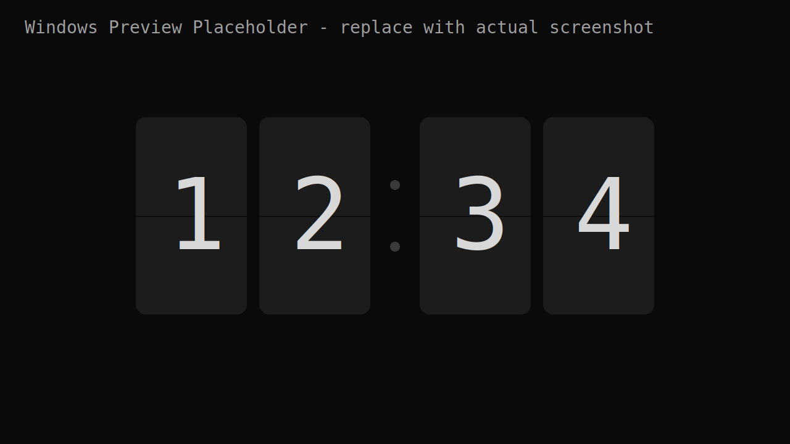
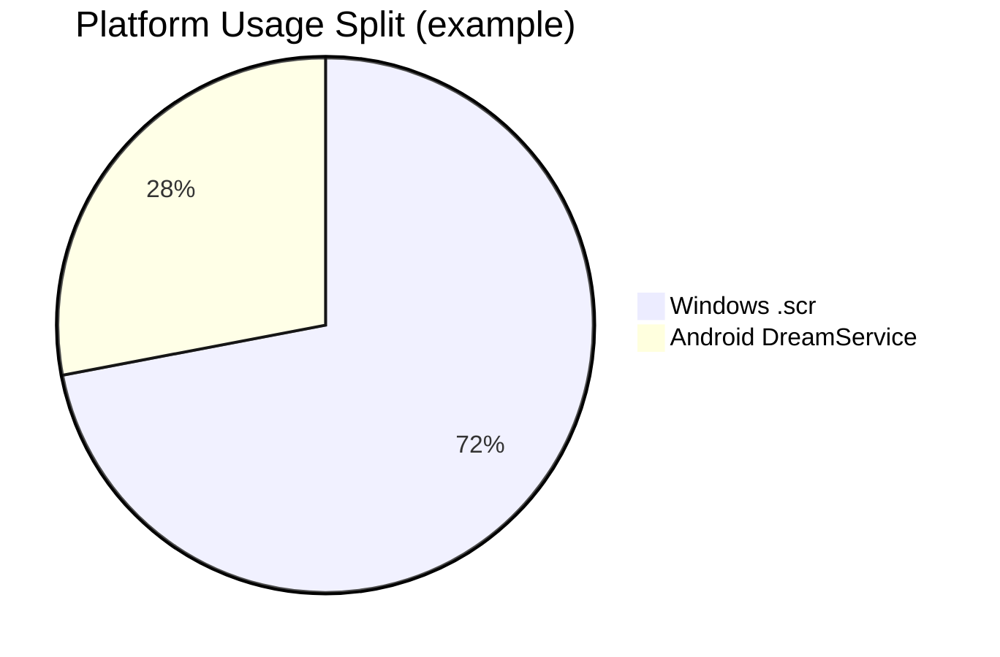
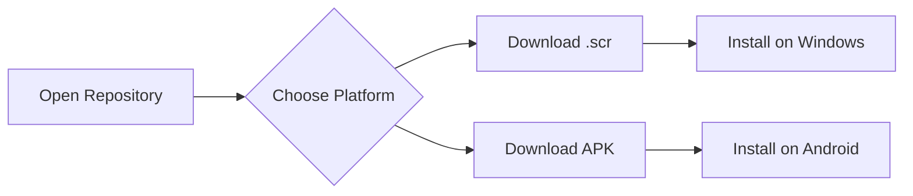

<div align="center">

# Fliqlo Reborn

A dual-platform flip clock screensaver project with a native Windows `.scr` and Android DreamService build in one repo.

[](https://github.com/<YOUR-USERNAME>/<YOUR-REPO>/releases/latest/download/FliqloScr-Windows-x64.scr)
[](https://github.com/<YOUR-USERNAME>/<YOUR-REPO>/releases/latest/download/FliqloReborn-Android.apk)
[](https://github.com/<YOUR-USERNAME>/<YOUR-REPO>/releases)

</div>

## Download Now

- Windows `.scr`: https://github.com/<YOUR-USERNAME>/<YOUR-REPO>/releases/latest/download/FliqloScr-Windows-x64.scr
- Android APK: https://github.com/<YOUR-USERNAME>/<YOUR-REPO>/releases/latest/download/FliqloReborn-Android.apk

After your first release, users can open this repo and download both builds directly from these links.

## Visuals

| Windows Screensaver | Android DreamService |
|---|---|
|  |  |

## Usage Graph





## Repository Structure

This monorepo keeps both codebases together but clearly separated by platform:

- `windows-src/` - WPF Windows screensaver source (`.scr` target)
- `android-src/` - Android app + DreamService source
- `shared/` - cross-platform design tokens and shared specs
- `docs/` - screenshots, behavior spec, and docs assets

## Build Locally

### Windows `.scr`

```bash
# from repo root
bash windows-src/build.sh
```

Windows output:

- `windows-src/FliqloScr/bin/Release/net10.0-windows/win-x64/publish/FliqloScr.scr`

### Android APK

```bash
cd android-src
./gradlew assembleRelease
```

Android output:

- `android-src/app/build/outputs/apk/release/app-release.apk`

## Source Code Entry Points

### Windows

- `windows-src/FliqloScr/Program.cs` - `/s`, `/p`, `/c` screensaver modes
- `windows-src/FliqloScr/ScreensaverWindow.xaml.cs` - full-screen + preview hosting logic
- `windows-src/FliqloScr/Rendering/FlipClockRenderer.cs` - flip digit rendering and animation pipeline
- `windows-src/FliqloScr/Engine/ClockEngine.cs` - clock timing and state transitions

### Android

- `android-src/app/src/main/java/com/flipclo/screensaver/FlipClockDreamService.kt` - DreamService entry point
- `android-src/app/src/main/java/com/flipclo/screensaver/FlipClockView.kt` - custom rendering view
- `android-src/app/src/main/java/com/flipclo/screensaver/ClockEngine.kt` - clock timing and transitions
- `android-src/app/src/main/java/com/flipclo/screensaver/SettingsActivity.kt` - settings UI

## Automated Releases

This repo includes GitHub Actions at:

- `.github/workflows/release.yml`

Release behavior:

1. Build Windows self-contained single-file binary and rename to `.scr`.
2. Build Android release APK.
3. Publish both artifacts into one GitHub Release.

To trigger a public download release, push a tag:

```bash
git tag v2.0.0
git push origin v2.0.0
```

## Create Private GitHub Repo (Initial Setup)

```bash
# from this project root
git init
git add .
git commit -m "Initial monorepo: Windows + Android + release automation"

# Requires GitHub CLI authenticated with your account
gh repo create <YOUR-REPO> --private --source . --remote origin --push
```

If you already created the private repo in GitHub UI:

```bash
git remote add origin https://github.com/<YOUR-USERNAME>/<YOUR-REPO>.git
git branch -M main
git push -u origin main
```

## Notes

- Replace every `<YOUR-USERNAME>` and `<YOUR-REPO>` in this README once the repo exists.
- To match the README visuals, replace `docs/media/windows-preview.svg` with a real Windows screenshot at the same path.
