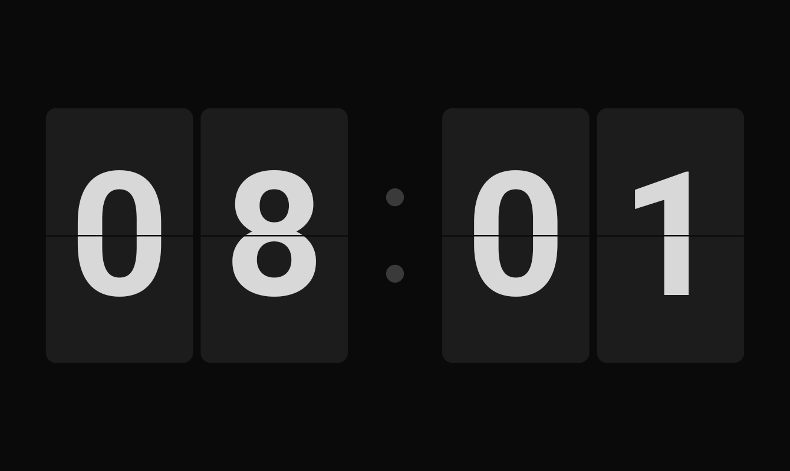
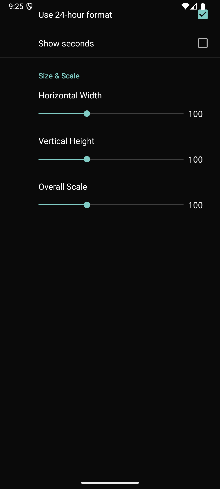
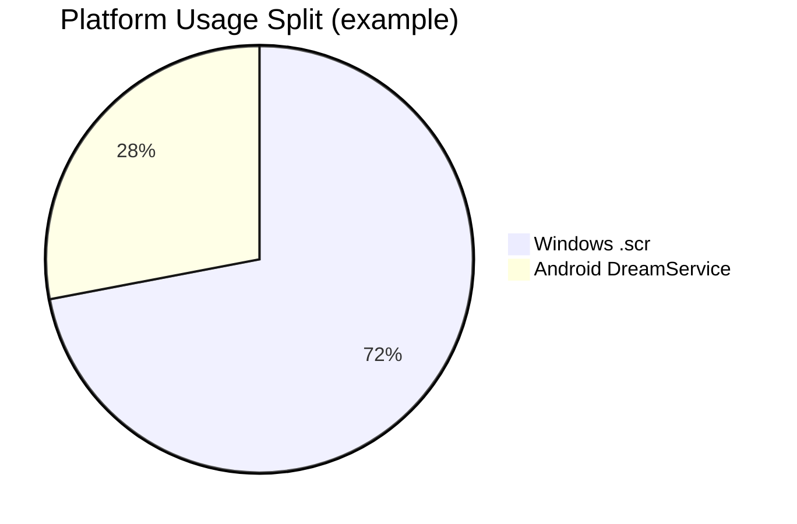
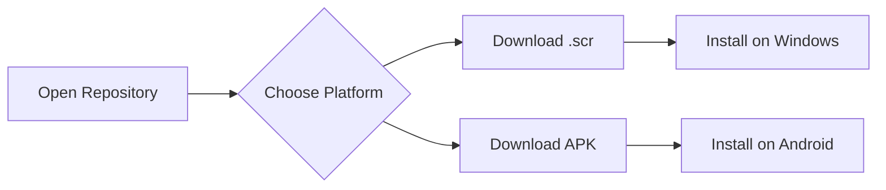

<div align="center">

# Flipqlo Reborn

A dual-platform flip clock screensaver project with a native Windows `.scr` and Android DreamService build in one repo.

[](https://github.com/FestinBiju/Flipqlo/releases/latest/download/Flipqlo-Windows-x64.scr)
[](https://github.com/FestinBiju/Flipqlo/releases/latest/download/Flipqlo-Android.apk)
[](https://github.com/FestinBiju/Flipqlo/releases)
[](LICENSE)

</div>

## Download Now

- Windows `.scr`: https://github.com/FestinBiju/Flipqlo/releases/latest/download/Flipqlo-Windows-x64.scr
- Android APK: https://github.com/FestinBiju/Flipqlo/releases/latest/download/Flipqlo-Android.apk


## Visuals

| Windows Screensaver | Android DreamService |
|---|---|
|  |  |

## Usage Graph





## Repository Structure

This monorepo keeps both codebases together but clearly separated by platform:

- `windows-src/` - WPF Windows screensaver source (`.scr` target)
- `android-src/` - Android app + DreamService source
- `shared/` - cross-platform design tokens and shared specs
- `docs/` - screenshots, behavior spec, and docs assets

## Build Locally

### Windows `.scr`

```bash
# from repo root
bash windows-src/build.sh
```

Windows output:

- `windows-src/Flipqlo/bin/Release/net10.0-windows/win-x64/publish/Flipqlo.scr`

### Android APK

```bash
cd android-src
./gradlew assembleRelease
```

Android output:

- `android-src/app/build/outputs/apk/release/app-release.apk`

## Source Code Entry Points

### Windows

- `windows-src/Flipqlo/Program.cs` - `/s`, `/p`, `/c` screensaver modes
- `windows-src/Flipqlo/ScreensaverWindow.xaml.cs` - full-screen + preview hosting logic
- `windows-src/Flipqlo/Rendering/FlipClockRenderer.cs` - flip digit rendering and animation pipeline
- `windows-src/Flipqlo/Engine/ClockEngine.cs` - clock timing and state transitions

### Android

- `android-src/app/src/main/java/com/flipqlo/screensaver/FlipClockDreamService.kt` - DreamService entry point
- `android-src/app/src/main/java/com/flipqlo/screensaver/FlipClockView.kt` - custom rendering view
- `android-src/app/src/main/java/com/flipqlo/screensaver/ClockEngine.kt` - clock timing and transitions
- `android-src/app/src/main/java/com/flipqlo/screensaver/SettingsActivity.kt` - settings UI

## License

This project is licensed under the MIT License. See [LICENSE](LICENSE).

